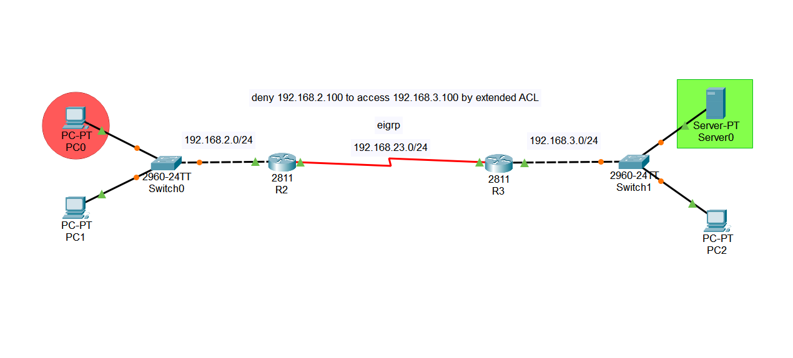

# Extended ACL Lab

> **Author:** Amirhossein Tavakoli
> **Tool:** Cisco Packet Tracer
> **Level:** Intermediate

---

## 📋 Overview

This lab demonstrates the implementation of Extended Access Control Lists (ACLs) to control network traffic. The configuration blocks a specific host from accessing a server while allowing all other devices to communicate normally.

---

## 🖧 Topology



---

## 🎯 Objectives

- Configure Extended ACL
- Deny one specific host
- Permit remaining traffic
- Configure EIGRP routing
- Verify ACL functionality
- Test server accessibility

---

## 🔧 Devices Used

| Device | Model | Role |
|--------|-------|------|
| R2 | Cisco 2811 | Router |
| R3 | Cisco 2811 | Router |
| Switch0 | Cisco 2960 | LAN Switch |
| Switch1 | Cisco 2960 | LAN Switch |
| PC0 | PC-PT | Blocked Client |
| PC1 | PC-PT | Allowed Client |
| PC2 | PC-PT | Remote Client |
| Server0 | Server-PT | Destination Server |

---

## ⚙️ Key Configurations

### Extended ACL

```bash
Router(config)# access-list 100 deny ip host 192.168.2.100 host 192.168.3.100
Router(config)# access-list 100 permit ip any any
```

### Apply ACL

```bash
Router(config)# interface Serial0/0/0
Router(config-if)# ip access-group 100 out
```

### EIGRP Configuration

```bash
Router(config)# router eigrp 100
Router(config-router)# network 192.168.23.0
Router(config-router)# no auto-summary
```

---

## ✅ Verification Commands

```bash
Router# show access-lists
Router# show ip interface
Router# show ip route
Router# ping 192.168.3.100
```

---

## 🌐 Network Addressing

| Network | Purpose |
|---------|---------|
| 192.168.2.0/24 | Client LAN |
| 192.168.23.0/24 | Router Link |
| 192.168.3.0/24 | Server LAN |

---

## 📁 Files

| File | Description |
|------|-------------|
| `ACL-lab.pkt` | Cisco Packet Tracer project |
| `topology.png` | Network topology |

---

## 📚 Concepts Covered

- Extended ACL
- Standard vs Extended ACL
- Traffic Filtering
- EIGRP
- Access Control
- Network Security
- Router-Based Packet Filtering
